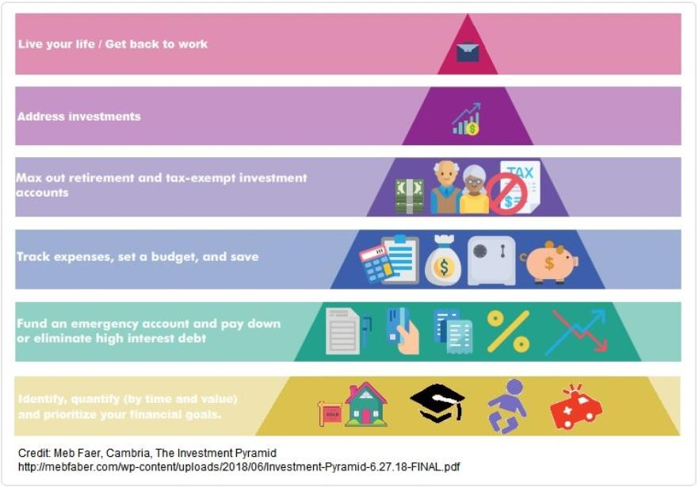
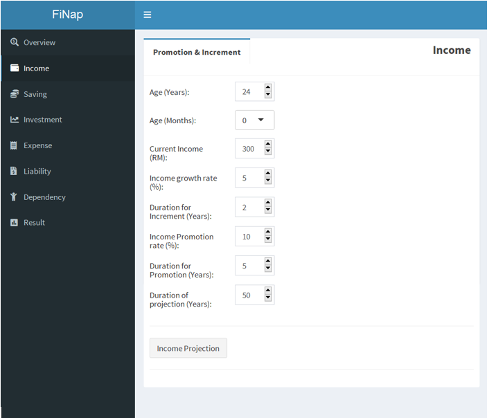
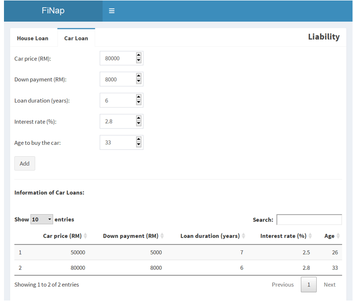
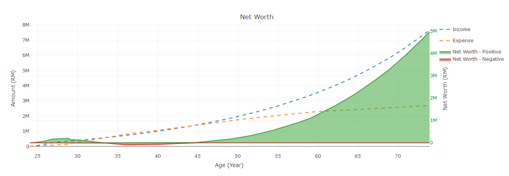

## Data Story

James is a 28-year-old accountant that earns RM 7000 monthly. He spent all his salary on luxuries and maxed out on credit cards. He even took up loan to finance overseas trip, luxurious car and expensive house. One day, his mother is diagnosed with cancer and needs a huge amount of medical expenses. Without any savings, investment or insurance, can he get by his current situation? Can he even plan for his retirement?
  

## Overview
FiNap is the solution for young working adults like James. By planning ahead of time, young working adults can manage their personal finance, have ample savings for emergency situations and plan for a prosperous retirement life.
  

## App Input

FiNap allows users to input data like income, saving, investment, expense, house loan, car loan and child education cost.
  
  

<!--  -->

## Projection

FiNap projects users' future income and expenses which allow users to see their net worth at the age of retirement.
  
<!--  -->

  
Finally, let's look at the demonstration of the app [here](https://jycheah.shinyapps.io/FiNap). 
